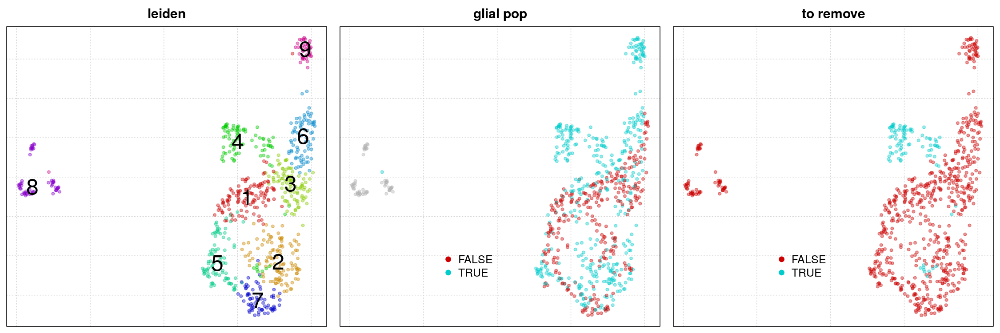

Preprocessing
================

  - [Importing functions and data](#importing-functions-and-data)
      - [Initialize SCE object](#initialize-sce-object)
  - [QC](#qc)
      - [Calculate QC metrics and filter
        cells](#calculate-qc-metrics-and-filter-cells)
      - [Create filtered expression
        object](#create-filtered-expression-object)
  - [Cleaning up glial contamination](#cleaning-up-glial-contamination)
      - [Removal of contaminated clusters in
        E16.5](#removal-of-contaminated-clusters-in-e16.5)
      - [Obtaining and removing glial code from
        E18.5](#obtaining-and-removing-glial-code-from-e18.5)
      - [Removing glial code from P3 using glial genes from
        E18.5](#removing-glial-code-from-p3-using-glial-genes-from-e18.5)
  - [Combining all timepoints](#combining-all-timepoints)
      - [Clustring and pathway overdisperstion using using
        pagoda2](#clustring-and-pathway-overdisperstion-using-using-pagoda2)
      - [Correcting count matrix with
        scde](#correcting-count-matrix-with-scde)
      - [Removal of vestibular neurons](#removal-of-vestibular-neurons)
      - [Time points alignment with Harmony and embedding with FIt-SNE
        and
        Palantir](#time-points-alignment-with-harmony-and-embedding-with-fit-sne-and-palantir)
  - [A more precise look at Hair
    cells](#a-more-precise-look-at-hair-cells)
  - [Saving objects](#saving-objects)

This notebook describe the full processing pipeline for filtering the
datasets and obtaining a pagoda2

# Importing functions and data

``` r
library(SingleCellExperiment)
library(scater)
library(ggplot2)

source("helpers/process.helpers.R")


cnts=as.matrix(read.csv("../_Data/raw_counts.csv",row.names = 1,check.names=FALSE))
```

## Initialize SCE object

``` r
batch=sapply(strsplit(colnames(cnts),":"),"[[",1)

devtime=factor(sapply(strsplit(batch,"_"),"[[",2))
devtime=plyr::mapvalues(devtime,c("18","19","15"),c("E16.5","E18.5","P3"))

anno = data.frame(cell=colnames(cnts),
             plate=sapply(strsplit(colnames(cnts),":"),"[[",1),
             devtime=devtime)

reads <- SingleCellExperiment(
  assays = list(counts = cnts),
  colData = anno
)

names(reads$plate)=anno$cell;names(reads$devtime)=anno$cell;
```

# QC

## Calculate QC metrics and filter cells

``` r
reads <- calculateQCMetrics(reads,feature_controls =
                              list(mito=rownames(reads)[grep("^mt-*",rownames(reads))],
                                   ercc=1:92))

reads = reads[,reads$total_features_by_counts!=0]

q1=ggplot() + 
  geom_histogram(aes(reads$total_counts),bins = 100) + 
  geom_vline(xintercept = 0.5e5, color = "red", size=1) +
  xlab("total counts")

filter_by_total_counts <- (reads$total_counts > 0.5e5)

q2 = ggplot() + 
  geom_histogram(aes(reads$total_features_by_counts),bins = 100) + 
  geom_vline(xintercept = 7000, color = "red", size=1) +
  xlab("total features")

filter_by_expr_features <- (reads$total_features_by_counts > 7000)

q3 = plotColData(reads,x="total_features_by_counts",y="pct_counts_mito", colour_by = "plate") + 
  geom_hline(yintercept = 15, color = "red", size=1) +theme(legend.position = "bottom")

filter_by_mito <- reads$pct_counts_mito < 15

q4 = plotColData(reads,x="total_features_by_counts",y="pct_counts_ercc", colour_by = "plate") + 
  geom_hline(yintercept = 15, color = "red", size=1) +theme(legend.position = "bottom")

filter_by_ercc <- reads$pct_counts_ercc < 15

reads$use <- (
  # sufficient features (genes)
  filter_by_expr_features &
    # sufficient molecules counted
    filter_by_total_counts &
    filter_by_mito & 
    filter_by_ercc
    
)

ggsave("figures/QC.png",cowplot::plot_grid(q1,q2,q3,q4,nrow = 1),width = 16,height = 4)
```


## Create filtered expression object

``` r
reads.filtered = reads[-(grep("ERCC",rownames(cnts))),reads$use]
```

# Cleaning up glial contamination

## Removal of contaminated clusters in E16.5

``` r
p2=p2.wrapper(counts(reads.filtered)[,reads.filtered$devtime%in%"E16.5"])

clu=as.numeric(p2$clusters$PCA$leiden)

clu[!clu%in%c(3,9)]=1
clu[clu%in%c(3,9)]=2
names(clu)=names(p2$clusters$PCA$leiden)

png("figures/cleanup_E16.5.png",width = 15,height = 5,res = 150,units = "in")
par(mfrow=c(1,3))
p2$plotEmbedding("PCA","UMAP",mark.clusters = T)
title("leiden")
p2$plotEmbedding("PCA","UMAP",colors=p2$counts[,"Sox10"])
title("Sox10")
p2$plotEmbedding("PCA","UMAP",groups=(clu==2),show.legend = T,legend.x = 12)
title("glial pop")
dev.off()

tokeep_E16.5=rownames(p2$counts)[!p2$clusters$PCA$leiden%in%c(3,9)]
```


## Obtaining and removing glial code from E18.5

``` r
p2=p2.wrapper(counts(reads.filtered)[,reads.filtered$devtime%in%"E18.5"])

clu=as.numeric(p2$clusters$PCA$leiden)

clu[clu%in%7]=NA
clu[clu%in%c(10,3,2,1,9)]=1
clu[clu%in%c(4:6,8)]=2

names(clu)=names(p2$clusters$PCA$leiden)
clu=clu[!is.na(clu)]
clu_E18.5=clu
res=p2$getDifferentialGenes(groups = clu,upregulated.only = T)
glia_E18.5=rownames(res[[1]])

png("figures/cleanup_E18.5.png",width = 15,height = 5,res = 150,units = "in")
par(mfrow=c(1,3))
p2$plotEmbedding("PCA","UMAP",mark.clusters = T)
title("leiden")
p2$plotEmbedding("PCA","UMAP",colors=p2$counts[,"Sox10"])
title("Sox10")
p2$plotEmbedding("PCA","UMAP",groups=(clu==1),show.legend = T,legend.x = .5)
title("glial pop")
dev.off()
```

 \#\#\# Reclustering
without glial genes

``` r
p2=p2.wrapper(counts(reads.filtered)[rownames(reads.filtered)[!rownames(reads.filtered)%in%glia_E18.5],reads.filtered$devtime%in%"E18.5"])

clu_torem=(p2$clusters$PCA$leiden==4)
names(clu_torem)=names(p2$clusters$PCA$leiden)

png("figures/cleanup_E18.5_2.png",width = 15,height = 5,res = 150,units = "in")
par(mfrow=c(1,3))
p2$plotEmbedding("PCA","UMAP",mark.clusters = T)
title("leiden")
p2$plotEmbedding("PCA","UMAP",groups=(clu==1),show.legend = T,legend.x = .5)
title("glial pop")
p2$plotEmbedding("PCA","UMAP",groups=clu_torem,show.legend = T,legend.x = .5)
title("to remove")
dev.off()

tokeep_E18.5=rownames(p2$counts)[!p2$clusters$PCA$leiden%in%4]
```



## Removing glial code from P3 using glial genes from E18.5

``` r
p2=p2.wrapper(counts(reads.filtered)[,reads.filtered$devtime%in%"P3"])

clu=as.numeric(p2$clusters$PCA$leiden)

clu[!clu%in%c(3,6)]=1
clu[clu%in%c(3,6)]=2
names(clu)=names(p2$clusters$PCA$leiden)


png("figures/cleanup_P3.png",width = 15,height = 5,res = 150,units = "in")
par(mfrow=c(1,3))
p2$plotEmbedding("PCA","UMAP",mark.clusters = T)
title("leiden")
p2$plotEmbedding("PCA","UMAP",colors=p2$counts[,"Sox10"])
title("Sox10")
p2$plotEmbedding("PCA","UMAP",groups=(clu==1),show.legend = T,legend.x = .5)
title("glial pop")
dev.off()
```


### Reclustering wihout glial genes

``` r
p2=p2.wrapper(counts(reads.filtered)[rownames(reads.filtered)[!rownames(reads.filtered)%in%glia_E18.5],reads.filtered$devtime%in%"P3"])


png("figures/cleanup_P3_2.png",width = 10,height = 5,res = 150,units = "in")
par(mfrow=c(1,2))
p2$plotEmbedding("PCA","UMAP",mark.clusters = T)
title("leiden")
p2$plotEmbedding("PCA","UMAP",groups=(clu==1),show.legend = T,legend.x = .5)
title("glial pop")
dev.off()

tokeep_P3=rownames(p2$counts)
```


# Combining all timepoints

## Clustring and pathway overdisperstion using using pagoda2

``` r
p2=p2.wrapper(counts(reads.filtered)[!rownames(reads.filtered)%in%glia_E18.5,c(tokeep_E16.5,tokeep_E18.5,tokeep_P3)])

p2$makeKnnGraph(k=20,type='PCA',center=T,distance='cosine');
p2$getKnnClusters("PCA",method = conos::leiden.community,resolution=2,name="leiden")
```

## Correcting count matrix with scde

``` r
counts=as.matrix(t(p2$misc$rawCounts))
mode(counts)<-"integer"
cdb <- gsub(":.*","",colnames(counts));
n.cores=10
min.cell.genes <- 3e3;min.cell.reads <- 1e3;min.gene.reads <- 10;
min.gene.cells <- 5;min.nonfailed <- 8;n.groups <- 10;trim <- 3;
res_scde <- scde.process.dataset(counts,"sgn",batch=cdb,skip.pca = T)

fpm <- log10(exp(scde::scde.expression.magnitude(res$knn, res$cd))+1)

save(res_scde,fpm,file = "_Output/res_scde.RData")
```

## Removal of vestibular neurons

``` r
p2_6=p2.wrapper(t(p2$misc$rawCounts[!p2$clusters$PCA$leiden%in%6,]))


p2_6$n.cores=5
go.env <- p2.generate.mouse.go(p2_6)
p2_6$testPathwayOverdispersion(setenv = go.env,recalculate.pca=F,
                                correlation.distance.threshold = 0.95,verbose = T)

myGeneNames <- colnames(p2_6$counts)
goSets <- p2.generate.mouse.go.web(myGeneNames)
deSets <- get.de.geneset(p2_6, groups = p2_6$clusters$PCA$leiden, prefix = 'de_')
geneSets_6 <- c(goSets, deSets)

p2_6$makeGeneKnnGraph(n.cores=5)


write.csv(p2_6$reductions$PCA,"output/PCA-6.csv")
```

## Time points alignment with Harmony and embedding with FIt-SNE and Palantir

### Installing FIt-SNE via bash

``` bash
git clone  https://github.com/KlugerLab/FIt-SNE
cd FIt-SNE
git checkout 5774b07
g++ -std=c++11 -O3  src/sptree.cpp src/tsne.cpp src/nbodyfft.cpp  -o bin/fast_tsne -pthread -lfftw3 -lm -Wno-address-of-packed-member
```

### python part

``` python
import harmony
import palantir
import os
import pandas as pd


data_df=pd.read_csv("output/PCA-6.csv",index_col=0)
dct={'P3':'SS2_15','E16.5':'SS2_18','E18.5':'SS2_19'}
tp = pd.Series(index=data_df.index)

for t in ['E16.5', 'E18.5','P3']:
    cells = data_df.index[data_df.index.str.contains(dct[t])]
    tp[cells] = t
    
timepoint_connections = pd.DataFrame(columns=[0, 1])
index = 0
timepoint_connections.loc[index, :] = ['E16.5', 'E18.5']; index += 1
timepoint_connections.loc[index, :] = ['E18.5', 'P3']; index += 1
timepoint_connections

aug_aff, aff = harmony.core.augmented_affinity_matrix(data_df, tp, timepoint_connections,pc_components=None)

dm_res = palantir.utils.run_diffusion_maps(aug_aff)
ms_data = palantir.utils.determine_multiscale_space(dm_res,n_eigs=6)
ms_data.index = data_df.index

import sys; sys.path.append('FIt-SNE')
from fast_tsne import fast_tsne

X=ms_data.values
Z=fast_tsne(X, perplexity_list=[20, 100], learning_rate=X.shape[0]/12,nthreads=20)
tsne=pd.DataFrame(Z)
tsne.columns=["x","y"]

ms_data.to_csv("ouput/msdata_pal-6.csv")
tsne2.to_csv("ouput/tsne_pal-6.csv")
```

### back to R

``` r
tsne=as.matrix(read.csv("_Output/tsne_pal-6.csv",row.names = 1))
ms_data=as.matrix(read.csv("_Output/msdata_pal-6.csv",row.names = 1))
p2_6$reductions$Diff=ms_data
p2_6$embeddings$Diff$tsne=tsne
```

# A more precise look at Hair cells

``` r
cnts_HC=t(p2_6$misc$rawCounts[p2_6$clusters$PCA$leiden%in%14,])

cnts_HC=cnts_HC[,colnames(cnts_HC)[5:dim(cnts_HC)[2]]] #remove E16

cnts_HC=cnts_HC[apply(cnts_HC,1,function(x) sum(x>0))!=0,]
p2_HC=p2.wrapper(cnts_HC)


# removal of vestibular HC
cnts_HC=t(p2_HC$misc$rawCounts[p2_HC$clusters$PCA$leiden!=2,])
p2_HC=p2.wrapper(cnts_HC)

u=doUMAP(p2_HC$reductions$PCA,10,.3)

p2_HC$getKnnClusters(method=conos::leiden.community,type='PCA',name = "leiden",resolution=.5)

p2_HC$getKnnClusters(method=conos::leiden.community,type='PCA',name = "leiden_1",resolution=1)

write.csv(p2_HC$embeddings$PCA$UMAP,"_Output/UMAP_HC.csv")
write.csv(p2_HC$clusters$PCA$leiden,"_Output/clusters_HC.csv")


p2_HC$n.cores=5
go.env <- p2.generate.mouse.go(p2_HC)
p2_HC$testPathwayOverdispersion(setenv = go.env,recalculate.pca=F,
                                correlation.distance.threshold = 1.6,verbose = T)

myGeneNames <- colnames(p2_HC$counts)
goSets <- p2.generate.mouse.go.web(myGeneNames)
deSets <- get.de.geneset(p2_HC, groups = p2_HC$clusters$PCA$leiden, prefix = 'de_')
geneSets_HC <- c(goSets, deSets)

p2_HC$makeGeneKnnGraph(n.cores=5)
```

# Saving objects

``` r
fpm=as.matrix(read.csv("_Output/fpm.csv",row.names = 1))
colnames(fpm)=sapply(colnames(fpm),function(ce) paste0(strsplit(ce,"[.]")[[1]],collapse = ":"))

hc_labs=p2_HC$clusters$PCA$leiden
hc_labs=plyr::mapvalues(hc_labs,1:2,c("IHC","OHC"))
p2_HC$clusters$PCA$labels=hc_labs

save(p2_HC,file="_Output/p2_HC.RData")

inter=intersect(rownames(fpm),colnames(p2_HC$counts))
p2_HC$counts=t(Matrix(fpm[inter,rownames(p2_HC$counts)],sparse=T))

cellmetadata=list()
cellmetadata$leiden=pagoda2::p2.metadata.from.factor(p2_HC$clusters$PCA$labels,displayname ="labels",
                                                     pal=c("#E31A1C","#1162A0"))


p2w <- make.p2.app(
  p2_HC,
  dendrogramCellGroups = p2_HC$clusters$PCA$leiden,
  additionalMetadata = cellmetadata,
  geneSets = geneSets_HC,
  show.clusters = FALSE # Hide the clusters that were used for the dendrogram from the metadata
)

p2w$serializeToStaticFast("_Output/p2w_HC.bin")
save(p2w,file="_Output/p2w_HC.RData")


reads.filtered_HC=reads.filtered[,rownames(p2_HC$counts)]

adata <- SingleCellExperiment(list(logcounts=t(p2_HC$counts)),
    colData=DataFrame(leiden=as.character(p2_HC$clusters$PCA$leiden),
                      devtime=as.character(reads.filtered_HC$devtime)),
    metadata=list(study="HC")
)

reducedDims(adata) <- list(pca=p2_HC$reductions$PCA,
                         umap=p2_HC$embeddings$PCA$UMAP)

save(adata,file = "_Output/adata_HC.RData")


save(p2_6,file="_Output/p2_6.RData")

inter=intersect(rownames(fpm),colnames(p2_6$counts))

p2_6$counts=t(Matrix(fpm[inter,rownames(p2_6$counts)],sparse=T))

cellmetadata=list()
devtime=factor(adata$devtime)
names(devtime)=rownames(p2_6$counts)
cellmetadata$time=p2.metadata.from.factor(devtime,
                                              pal=viridisLite::viridis(3),
                                              displayname = "devtime")


lei=c(4,1,
10,13,12,
2,16,3,
9,15,17,
5,11,7,8,
18,19,14)
leiden=factor(as.numeric(p2_6$clusters$PCA$leiden),levels = lei)
lei2=c(14,15,
11,12,13,
8,9,10,
5,6,7,
2,1,3,4,
18,16,17)
leiden=mapvalues(leiden, from = lei, to = lei2)
names(leiden)=rownames(p2_6$counts)
p2_6$clusters$PCA$leiden=leiden


pal=c("#417239","#88EA75",
  "#375575","#669ED6","#A0CBE8",
  "#B24145","#FD5B49","#EDB6B6",
  "#cf33ff","#ff4ff6","#F4ADE4",
  "#CFB53B","#fcf4a3","#fff200","#fcd12a",
  "#917924","#79706E","#BAB0AC")

cellmetadata$leiden=pagoda2::p2.metadata.from.factor(p2_6$clusters$PCA$leiden,displayname ="leiden",pal=pal)

p2w <- make.p2.app(
  p2_6,
  dendrogramCellGroups = p2_6$clusters$PCA$leiden,
  additionalMetadata = cellmetadata,
  geneSets = geneSets_6,
  show.clusters = FALSE 
)

p2w$serializeToStaticFast("_Output/p2w_SGN.bin")
save(p2w,file="_Output/p2w_SGN.RData")

reads.filtered_6=reads.filtered[,rownames(p2_6$counts)]

adata <- SingleCellExperiment(list(logcounts=t(p2_6$counts)),
    colData=DataFrame(leiden=as.character(p2_6$clusters$PCA$leiden),
                      devtime=as.character(reads.filtered_6$devtime)),
    metadata=list(study="SGN")
)

reducedDims(adata) <- list(pca=p2_6$reductions$PCA,
                           X_diffusion=p2_6$reductions$Diff,
                         tsne=p2_6$embeddings$Diff$tsne)

save(adata,file = "_Output/adata_SGN.RData")
```
