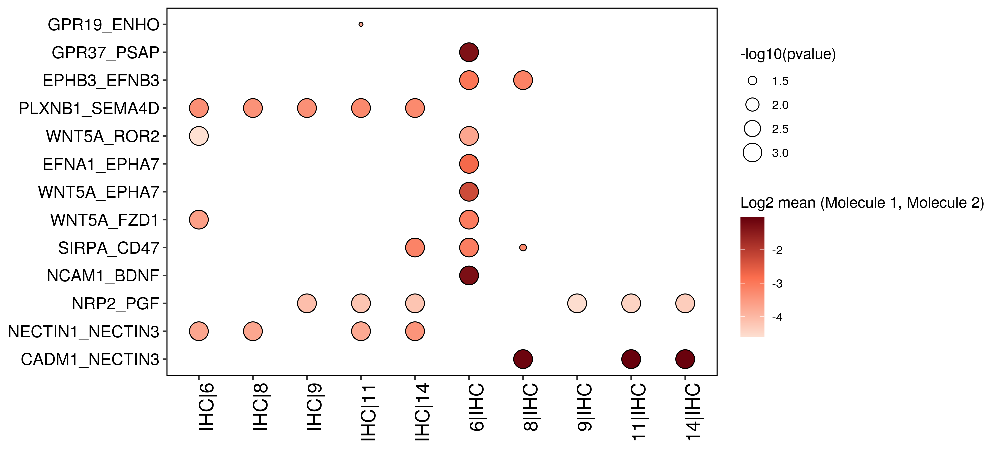

Preprocessing
================

  - [Loading libraries and data](#loading-libraries-and-data)
  - [Preparing data](#preparing-data)
  - [Running cellphonedb (bash)](#running-cellphonedb-bash)
  - [Plotting](#plotting)
      - [IHC](#ihc)
      - [OHC](#ohc)

# Loading libraries and data

# Preparing data

``` r
sel=c("OHC","IHC","6","8","9","11","14")

tt=as.matrix(t(p2$counts[leiden%in%sel,]))
tt=fpm[,leiden%in%sel]
rownames(tt)=toupper(rownames(tt))
tt=data.frame("Genes"=rownames(tt),tt)

write.table(tt,"_cellphonedb/fpm.txt",quote = F,row.names = F,sep = "\t")

labs=leiden[leiden%in%sel]
names(labs)=stringr::str_replace(names(labs),pattern = ":",replacement = ".")

write.table(data.frame(Cell=names(labs),cell_type=labs),"_cellphonedb/meta.txt",
            row.names = F,quote = F,sep = "\t")
```

# Running cellphonedb (bash)

``` bash
p=_cellphonedb/
cellphonedb method statistical_analysis "$p"meta.txt "$p"counts.txt --counts-data hgnc_symbol --threads=40 --output-path="$p"out
```

# Plotting

``` r
all_pval = read.table("_cellphonedb/out/pvalues.txt", header=T, 
                      stringsAsFactors = F, sep="\t", comment.char = '', check.names=F)


all_means = read.table("_cellphonedb/out/means.txt", header=T, 
                      stringsAsFactors = F, sep="\t", comment.char = '', check.names=F)

order1=c("OHC","IHC")
order2=c("6","8","9","11","14")
```

## IHC

``` r
cols=c(paste(order1[2],order2,sep = "|"),paste(order2,order1[2],sep = "|"))

dtp1=dotplot(all_pval,all_means,cols)

ggsave(filename = "figures/cellphone_IHC_dotplot.png",height = 32,width = 10,dpi = 300,units = "in")
```


``` r
sub_pval=all_pval[apply(all_pval[,cols]<0.05,1,any),]
sub_means=all_means[apply(all_pval[,cols]<0.05,1,any),]

for (i in 1:nrow(sub_pval)){
  for (clus in cols[which(sub_pval[i,cols]<0.05)]){
    pair=sapply(tolower(sub_pval[i,c("gene_a","gene_b")]),.simpleCap)
    if (!(all(pair%in%rownames(fpm)))){
      #print("no expression")
      sub_pval[i,clus]=1
    } else if (!all(sapply(strsplit(clus,"[|]")[[1]], function(cl){rowMeans(fpm[pair,
               names(leiden)[leiden%in%cl]])>1}))){
      #print("low expression")
      sub_pval[i,clus]=1
               }
  }
}

dtp1=dotplot(sub_pval,sub_means,cols)

ggsave(filename = "figures/cellphone_IHC_dotplot_filtered_1.png",height = 4.5,width = 10,dpi = 300,units = "in")
```



``` r
sub_pval=all_pval[apply(all_pval[,cols]<0.05,1,any),]
sub_means=all_means[apply(all_pval[,cols]<0.05,1,any),]

for (i in 1:nrow(sub_pval)){
  for (clus in cols[which(sub_pval[i,cols]<0.05)]){
    pair=sapply(tolower(sub_pval[i,c("gene_a","gene_b")]),.simpleCap)
    if (!(all(pair%in%rownames(fpm)))){
      print("no expression")
      sub_pval[i,clus]=1
    } else if (!all(sapply(strsplit(clus,"[|]")[[1]], function(cl){rowMeans(fpm[pair,
               names(leiden)[leiden%in%cl]])>0.5}))){
      print("low expression")
      sub_pval[i,clus]=1
               }
  }
}

dtp1=dotplot(sub_pval,sub_means,cols)

ggsave(filename = "figures/cellphone_IHC_dotplot_filtered_0.5.png",height = 6.5,width = 10,dpi = 300,units = "in")
```


## OHC

``` r
cols=c(paste(order1[1],order2,sep = "|"),paste(order2,order1[1],sep = "|"))

dtp2=dotplot(all_pval,all_means,cols)

ggsave(filename = "figures/cellphone_OHC_dotplot.png",height = 32,width = 10,dpi = 300,units = "in")
```


``` r
sub_pval=all_pval[apply(all_pval[,cols]<0.05,1,any),]
sub_means=all_means[apply(all_pval[,cols]<0.05,1,any),]

for (i in 1:nrow(sub_pval)){
  for (clus in cols[which(sub_pval[i,cols]<0.05)]){
    pair=sapply(tolower(sub_pval[i,c("gene_a","gene_b")]),.simpleCap)
    if (!(all(pair%in%rownames(fpm)))){
      print("no expression")
      sub_pval[i,clus]=1
    } else if (!all(sapply(strsplit(clus,"[|]")[[1]], function(cl){rowMeans(fpm[pair,
               names(leiden)[leiden%in%cl]])>1}))){
      print("low expression")
      sub_pval[i,clus]=1
               }
  }
}

dtp2=dotplot(sub_pval,sub_means,cols)

ggsave(filename = "figures/cellphone_OHC_dotplot_filtered_1.png",height = 4.5,width = 10,dpi = 300,units = "in")
```


``` r
sub_pval=all_pval[apply(all_pval[,cols]<0.05,1,any),]
sub_means=all_means[apply(all_pval[,cols]<0.05,1,any),]

for (i in 1:nrow(sub_pval)){
  for (clus in cols[which(sub_pval[i,cols]<0.05)]){
    pair=sapply(tolower(sub_pval[i,c("gene_a","gene_b")]),.simpleCap)
    if (!(all(pair%in%rownames(fpm)))){
      #print("no expression")
      sub_pval[i,clus]=1
    } else if (!all(sapply(strsplit(clus,"[|]")[[1]], function(cl){rowMeans(fpm[pair,
               names(leiden)[leiden%in%cl]])>0.5}))){
      #print("low expression")
      sub_pval[i,clus]=1
               }
  }
}

dtp2=dotplot(sub_pval,sub_means,cols)

ggsave(filename = "figures/cellphone_OHC_dotplot_filtered_0.5.png",height = 7,width = 10,dpi = 300,units = "in")
```


