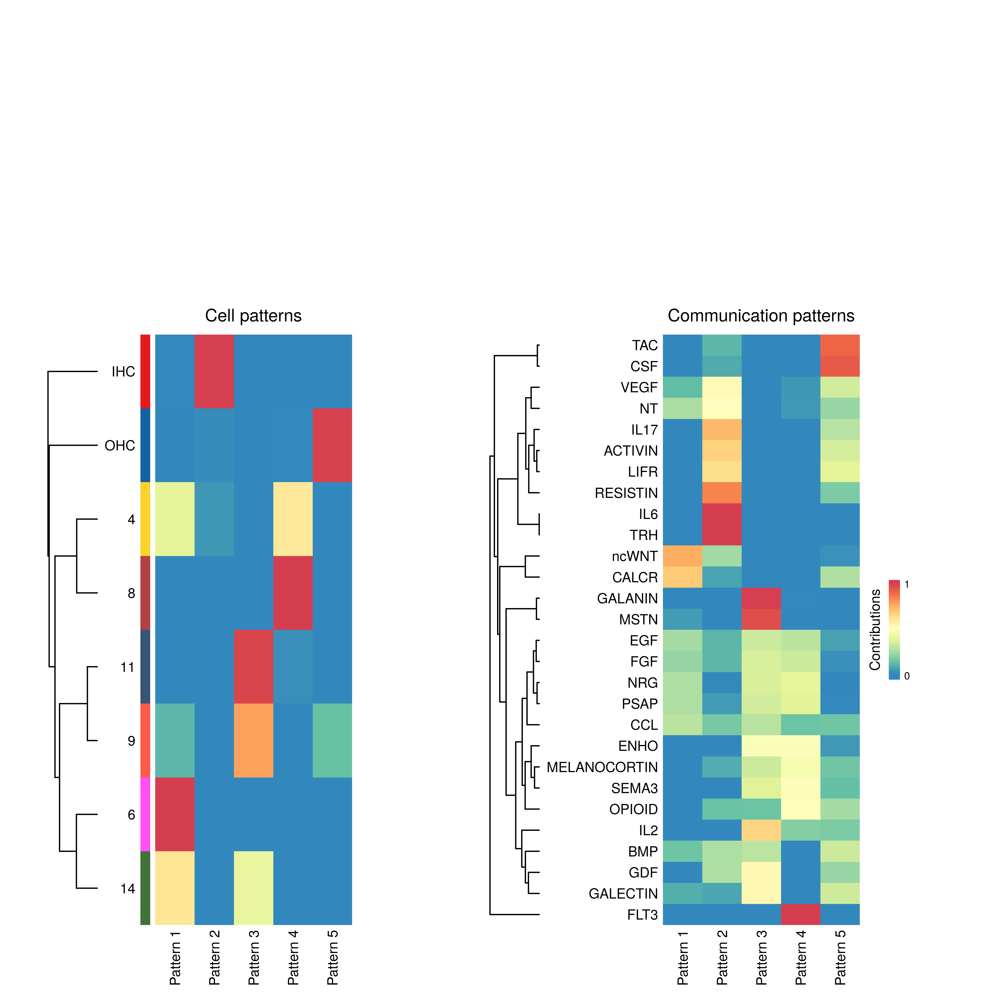
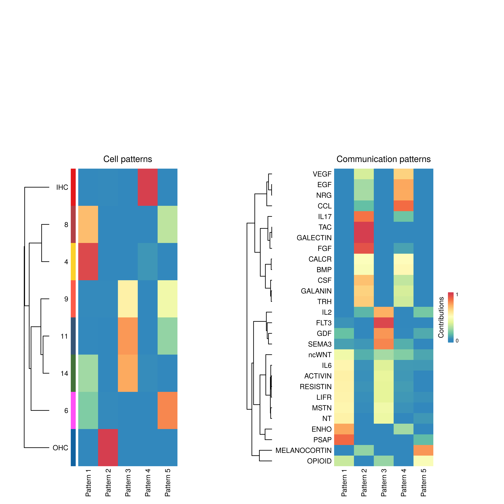

CellChat
================

# Load data

``` r
library(Matrix)
library(CellChat)
library(ggplot2)
library(ggalluvial)
library(svglite)
options(stringsAsFactors = FALSE)


load("_Output/p2w_SGN.RData")
p2=p2w$originalP2object

load("_Output/p2w_HC.RData")
p2_HC=p2w$originalP2object

leiden=as.character(p2$clusters$PCA$leiden)
names(leiden)=rownames(p2$counts)
leiden[rownames(p2_HC$counts)]=as.character(p2_HC$clusters$PCA$labels)


fpm=as.matrix(read.csv("_Output/fpm.csv",row.names = 1))
colnames(fpm)=stringr::str_replace(colnames(fpm),"[.]",":")
fpm=fpm[,rownames(p2$counts)]


leiden=leiden[leiden%in%c("14","11","8","9","4","6","IHC","OHC")]

fpm=fpm[,names(leiden)]
```

# Analysis

``` r
cellchat <- createCellChat(data = fpm)

identity = data.frame(group = leiden, row.names = names(leiden))
cellchat <- addMeta(cellchat, meta = identity, meta.name = "leiden")
cellchat <- setIdent(cellchat, ident.use = "leiden")
CellChatDB <- CellChatDB.mouse # use CellChatDB.human if running on human data
CellChatDB.use <- subsetDB(CellChatDB, search = "Secreted Signaling") # use Secreted Signaling for cell-cell communication analysis
cellchat@DB <- CellChatDB.use # set the used database in the object
cellchat <- subsetData(cellchat) # subset the expression data of signaling genes for saving computation cost

future::plan("multiprocess", workers = 5) # do parallel
cellchat <- identifyOverExpressedGenes(cellchat)
cellchat <- identifyOverExpressedInteractions(cellchat)
cellchat <- projectData(cellchat, PPI.mouse)
cellchat <- computeCommunProb(cellchat)
cellchat <- computeCommunProbPathway(cellchat)
cellchat <- aggregateNet(cellchat)

pal=c("#375575","#417239","#fcd12a","#ff4ff6","#B24145","#FD5B49","#E31A1C","#1162A0")
```

``` r
nPatterns = 5
png("CellChat/Patterns_outgoing.png",res = 600,height = 8,width=8,units = "in")
cellchat <- identifyCommunicationPatterns(cellchat, pattern = "outgoing", k = nPatterns,height = 12,width=4,color.use = pal)
dev.off()


nPatterns = 5
png("CellChat/Patterns_incoming.png",res = 600,height = 8,width=8,units = "in")
cellchat <- identifyCommunicationPatterns(cellchat, pattern = "incoming", k = nPatterns,height = 12,width=4,color.use = pal)
dev.off()
```



``` r
groupSize <- as.numeric(table(cellchat@idents))

pathways_outgoing=c("TAC","CSF","VEGF","IL17","ACTIVIN","LIFR","RESISTIN","IL6","TRH")

pathways_incoming=c("VEGF","EGF","NRG","CCL","IL17","TAC","GALECTIN","FGF","CALCR","BMP","CSF","GALANIN","TRH")

pathways_both=intersect(pathways_outgoing,pathways_incoming)

pathways_outgoing = setdiff(pathways_outgoing,pathways_both)

pathways_incoming = setdiff(pathways_incoming,pathways_both)

for (pathway in pathways_outgoing){
  png(paste0("CellChat/Outgoing/",pathway,".png"),res = 600,height = 8,width=8,units = "in")
  netVisual_aggregate(cellchat, signaling = c(pathway), layout = "circle", vertex.size = groupSize,color.use = pal)
  dev.off()
}

for (pathway in pathways_incoming){
  png(paste0("CellChat/Incoming/",pathway,".png"),res = 600,height = 8,width=8,units = "in")
  netVisual_aggregate(cellchat, signaling = c(pathway), layout = "circle", vertex.size = groupSize,color.use = pal)
  dev.off()
}

for (pathway in pathways_both){
  png(paste0("CellChat/Both/",pathway,".png"),res = 600,height = 8,width=8,units = "in")
  netVisual_aggregate(cellchat, signaling = c(pathway), layout = "circle", vertex.size = groupSize,color.use = pal)
  dev.off()
}
```
